# Data-Science-Programming

## DSP-1 Covers various Topics 

- Data set Preparation

- Types of Values

- Categorical Class, Nominal, Ordinal, Binary

- split of data (train & test)

- After getting the data ask these questions

  1.  -What is the unit of analysis?

  2.  -What are the predictors (features)?

  3.  -What is the target/outcome variable?

  4.  -Where is the data coming from?

  5.  -Internal, external, combined?

  6.  -How much data do you have (i.e., how many rows?)

  7.  -What do to if data is too little or too much?

<!-- -->

- -Discover and Visualize

- -Use visualization.

  1.  -Histograms, boxplots, scatter plots

  2.  -Use multiple variables in one plot when possible

- Observe descriptive statistics.

  1.  -How to interpret mean, median, std.dev, min, max?

- -Observe correlations

- -What is correlation?

- -Reduce variables (if needed) (how?)

- -Data Preparation/ feature engineering

- -Data Transformation

- -Train Models

- -Model Evaluation (Classification/Regression)

## DSP- 2 Regression

- $y = \beta_{0} + \beta_{1}x_{1} + \beta_{2}x_{2} + \beta_{3}x_{3} + \ldots + \beta_{n}x_{n}$

- How do we "train" the model: Find the set of betas that minimize RMSE
  (or, MSE – easier to do)

- 1\) The Normal Equation (closed-form solution):

- ${\beta = \left( X^{T}X \right)}^{- 1}X^{T}y$

- X: Training set

- y: vector of output values

- Computationally very costly (if there are lots of features, or lots of
  data)

- 2\) Optimizer: **Gradient Descent**

- Gradient Descent

- A generic optimization algorithm

- Tweak the parameters <u>iteratively</u> to minimize the cost function
  (SSE, MSE, RMSE, etc.)

- What do you mean by "minimize"???

- Lost in a mountain

- How do you get to the bottom? (i.e., "minimize")

- Feel slope below your feet!

- Then, go in the direction of steepest (descending) slope

- 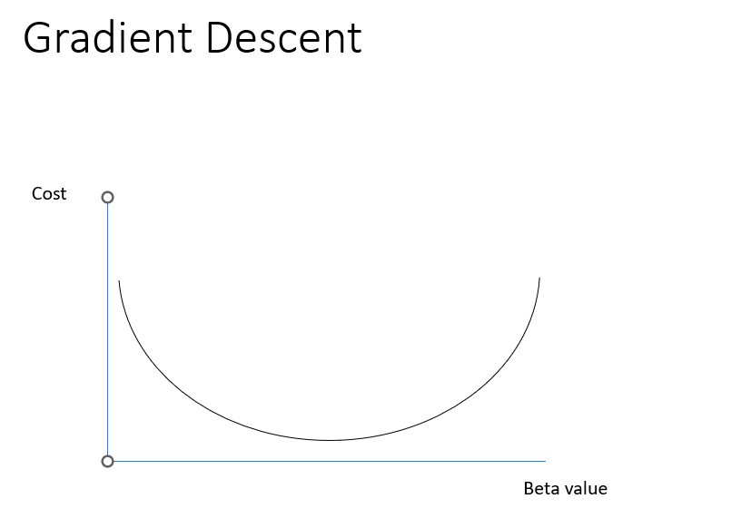

> 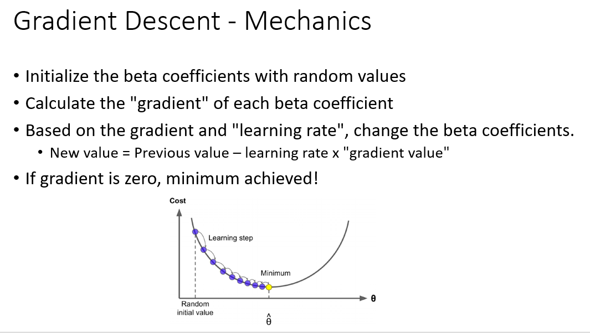 alt="Chart Description automatically generated with low confidence" />
>
> 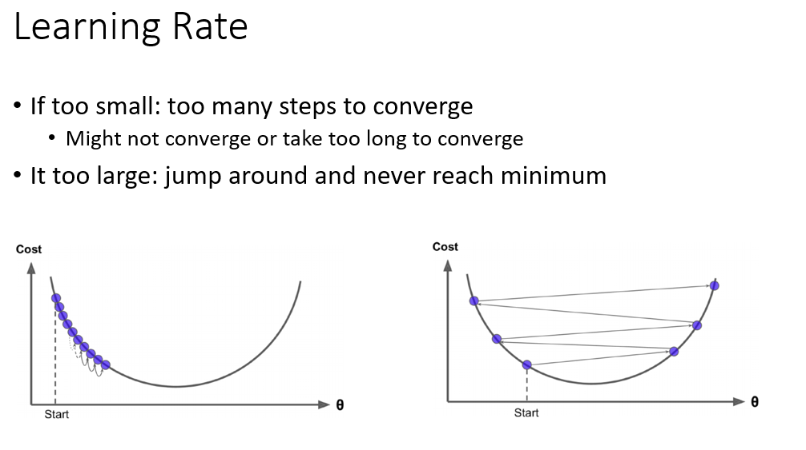 alt="A picture containing diagram Description automatically generated" />
>
> 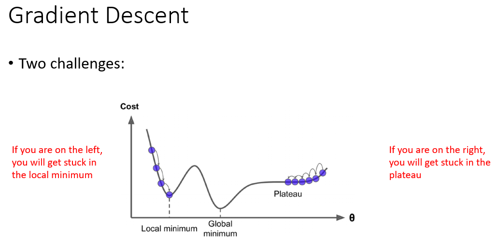 alt="Chart, line chart Description automatically generated" />

- Stochastic Gradient Descent

- Mini-Batch Gradient Descent

- Polynomial Regression

- Regularization:

<!-- -->

- L2 Regularization (Ridge Regression)

- L1 Regularization (Lasso Regression)

- Elastic Net

- Early Stopping

<!-- -->

- Logistic Regression

- Softmax Regression

## DSP 3 : Support Vector Machines & Logistic Regression

## DSP 4: Decision Tree

## DSP 5: Ensemble Technicques

## DSP 6- Text Mining 

## DSP 7- Neural Networks

## DSP 8- DNN- Deep Neural Networks (Keras) 

> 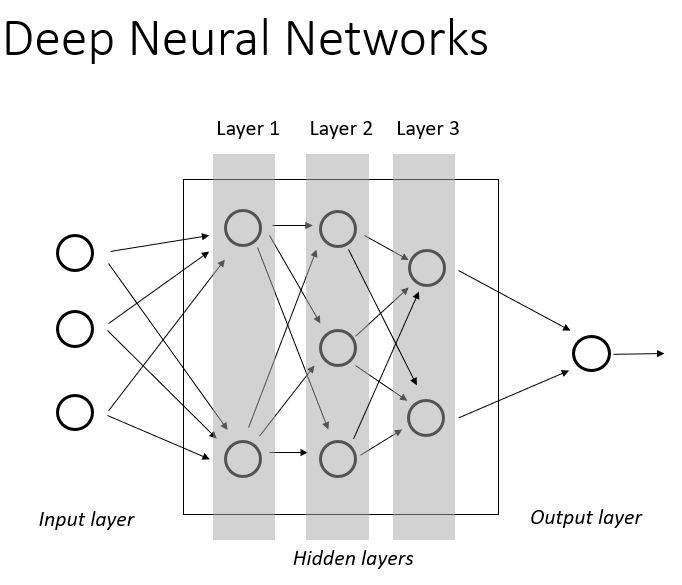 alt="Diagram Description automatically generated" />
>
> 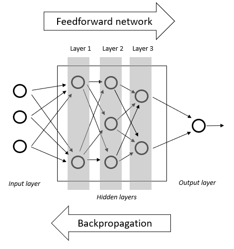 alt="Diagram Description automatically generated" />

## DSP 9- CNN – Convolutional Neural Nets (Keras)

> 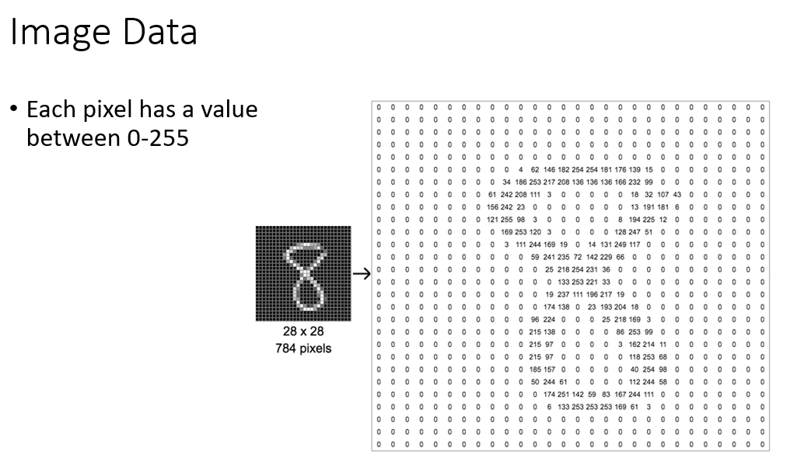 alt="A picture containing graphical user interface Description automatically generated" />
>
> 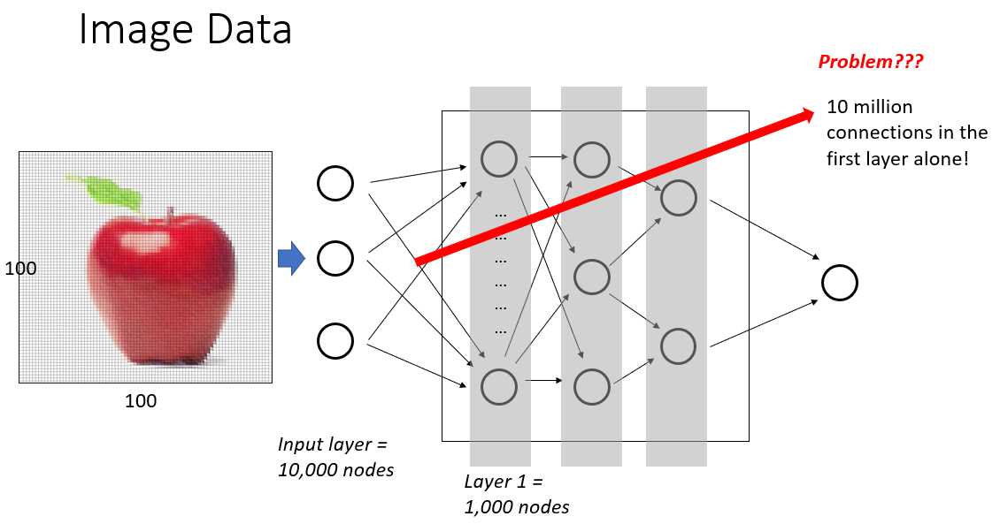 alt="Diagram Description automatically generated" />
>
>  alt="Diagram Description automatically generated" />

## 

## DSP 10- RNN- Recurrent Neural Networks 

> 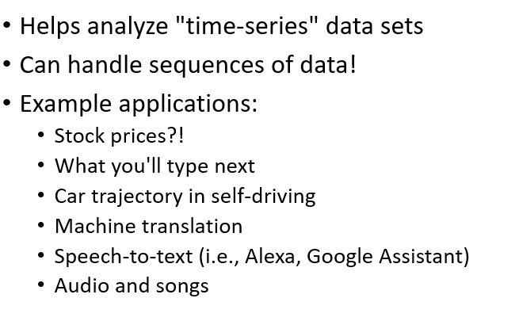 alt="Graphical user interface, text, application Description automatically generated" />
>
> 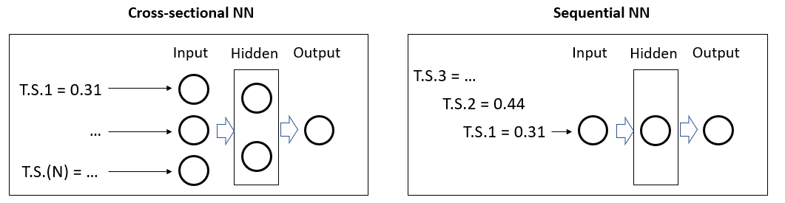 alt="Letter Description automatically generated with low confidence" />

## DSP 11- Encoders

> 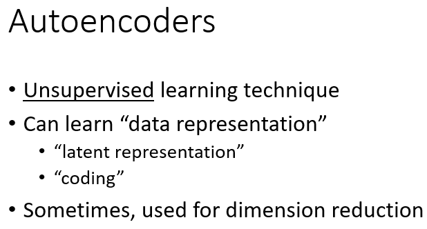 alt="Graphical user interface, text, application Description automatically generated" />
>
> 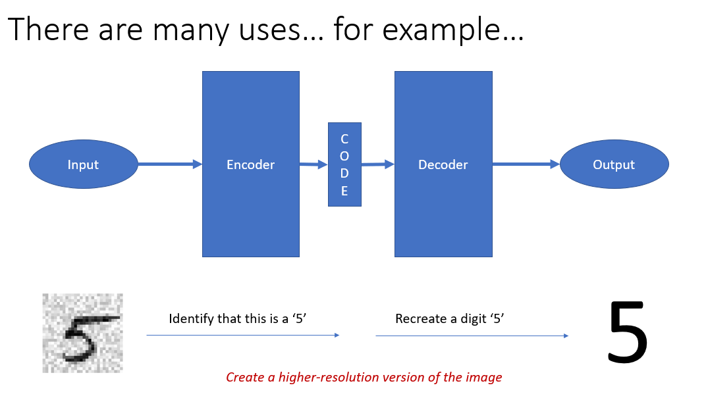 alt="Chart, waterfall chart Description automatically generated" />
